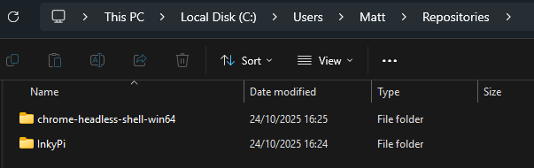

# InkyPi Development Quick Start

## Development Without Hardware

The `--dev` flag enables complete development without requiring:

- Raspberry Pi hardware
- Physical e-ink displays (Inky pHAT/wHAT or Waveshare)
- Root privileges or GPIO access
- Linux-specific features (systemd)

Works on **macOS**, **Linux**, and **Windows** - no hardware needed!

## Setup

```bash
# 1. Clone and setup
git clone https://github.com/fatihak/InkyPi.git
cd InkyPi

# 2. Create virtual environment
python3 -m venv venv
source venv/bin/activate  # Windows: venv\Scripts\activate

# 3. Install Python dependencies and run
pip install -r install/requirements-dev.txt
bash install/update-vendors.sh
python src/inkypi.py --dev
```

**That's it!** Open http://localhost:8080 and start developing.

## What You Can Do

- **Develop plugins** - Create new plugins without hardware (no Raspberry Pi, nor physical displays)
- **Test UI changes** - Instant feedback on web interface modifications  
- **Debug issues** - Full error messages in terminal
- **Verify rendering** - Check output in `mock_display_output/latest.png`
- **Cross-platform development** - Works on macOS, Linux, Windows

## Essential Commands

```bash
source venv/bin/activate             # Activate virtual environment
python src/inkypi.py --dev           # Start development server
deactivate                           # Exit virtual environment
```

## Development Tips

1. **Check rendered output**: Images are saved to `mock_display_output/`
2. **Plugin development**: Copy an existing plugin as template (e.g., `clock/`)
3. **Configuration**: Edit `src/config/device_dev.json` for display settings
4. **Hot reload**: Restart server to see code changes

## Testing Your Changes

1. Configure a plugin through the web UI
2. Click "Display" button
3. Check `mock_display_output/latest.png` for result
4. Iterate quickly without deployment

## Other Requirements 
InkyPi relies on system packages for some features, which are normally installed via the `install.sh` script. 

For a local development instance you must manually manage these requirements.

### Linux
The required packages can be found in this file: 

https://github.com/fatihak/InkyPi/blob/main/install/debian-requirements.txt

Use your favourite package manager (such as `apt`) to install them.

### Windows & macOS
The most important package is `chromium-headless-shell`, which is used to render HTML templates to PNG images.

Chromium Headless Shell doesn't appear to be available for Windows and macOS, but the alternative Chrome Headless Shell is. Download a suitable release of `chrome-headless-shell` for your OS (i.e. win64 = Windows 11 64-bit, or mac-arm64 = Apple Silicon Mac) from here:

https://googlechromelabs.github.io/chrome-for-testing/

Unzip 'chrome-headless-shell-win64.zip' in the same parent folder as InkPi:



And edit [src/utils/image_utls.py](https://github.com/fatihak/InkyPi/blob/9d9dbc9f338284f1663c2d706570c40cdd64535f/src/utils/image_utils.py#L111) to:

#### Windows

```python
        command = [
            "..\chrome-headless-shell-win64\chrome-headless-shell.exe",
```
#### macOS

```python
        command = [
            "..\chrome-headless-shell-mac-arm64\chrome-headless-shell",
```
